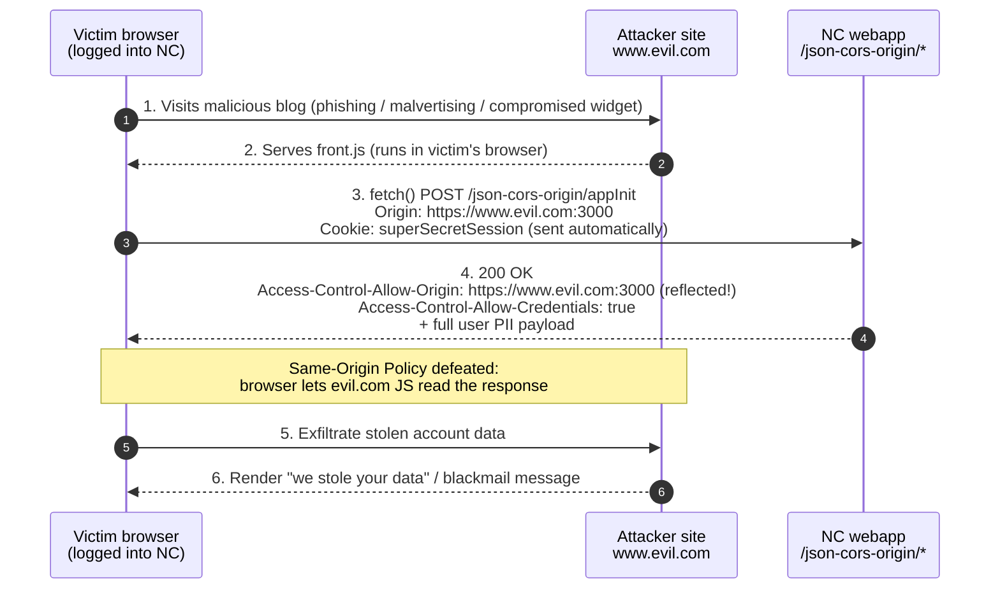
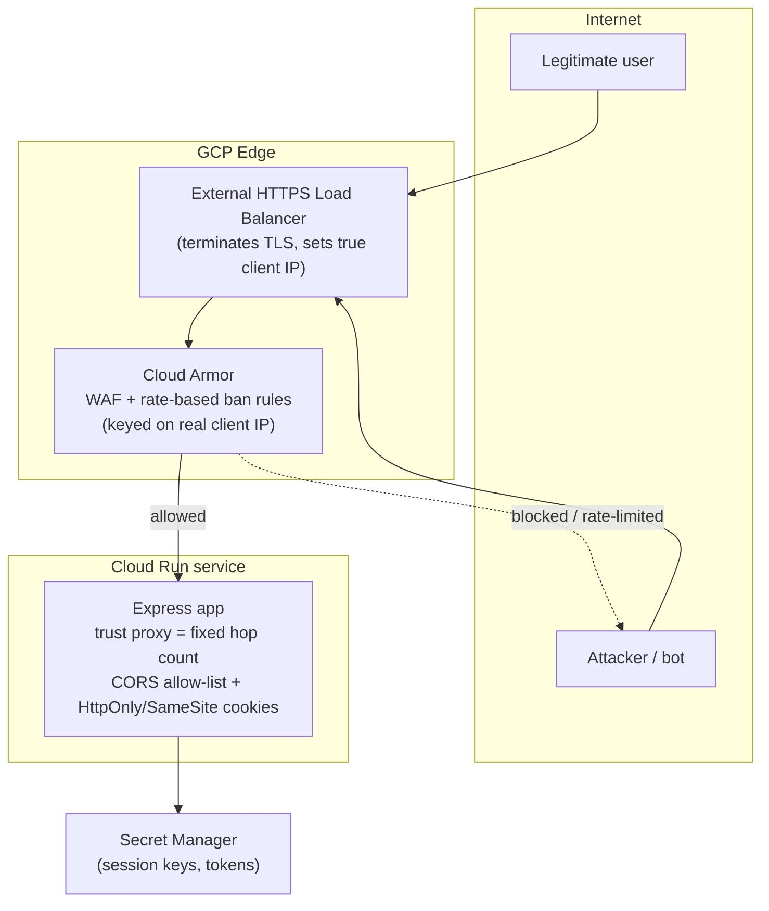
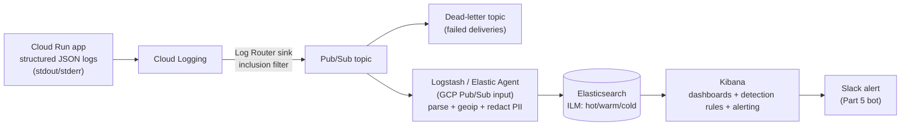
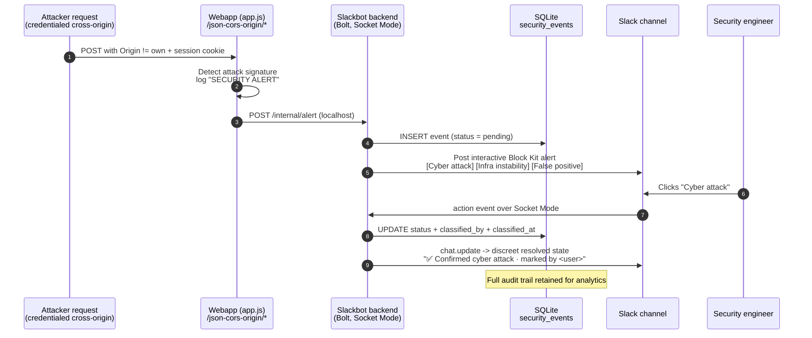
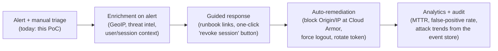

# Architecture, Key Takeaways & Security Automation Roadmap

This document complements `REPORT.md` with visual architecture, the reasoning behind the technical
choices, and where this work extends into a broader security-automation capability. Diagrams are
Mermaid (render natively on GitHub).

---

## 1. Part 1 — how the CORS attack works (current, vulnerable)

**Root cause in one line:** the server reflects any `Origin` into `Access-Control-Allow-Origin`
*and* sets `Access-Control-Allow-Credentials: true`, while the session cookie is neither `HttpOnly`
nor `SameSite`-restricted — so any site the victim visits can make authenticated calls and read the
result.

---

## 2. Target hardened architecture (GCP, Cloud Run)

The same app deployed the way it should be, addressing **Part 1** (CORS/cookies) and **Part 2**
(trusted client IP) at the right layers.

**Why each control sits where it does**

| Concern | Fix | Layer | Why here |
|---|---|---|---|
| CORS data theft (Part 1) | Origin allow-list, no reflect-with-credentials; `HttpOnly`+`SameSite` cookies | App | Origin/cookie policy is application logic |
| Spoofable `req.ip` (Part 2) | `trust proxy` = exact hop count (not `true`); or trust a Cloud-Armor-verified header | App + Edge | Only the edge knows the real client IP |
| Volumetric abuse / brute force | Cloud Armor rate-based ban rules on the true client IP | Edge | Stop it before it consumes Cloud Run instances (cost + spoof-proof) |
| Secrets | Secret Manager, not env files in the image | Platform | Rotation + least privilege |

---

## 3. Part 3 — log pipeline to ELK SIEM

**Design rationale (the follow-up-meeting talking points):**
- **No agent on Cloud Run** — the platform already ships stdout/stderr to Cloud Logging; the app's
  only job is to emit *structured* JSON so fields are queryable without regex.
- **Pub/Sub decouples produce from consume** — if ELK is down/upgrading, messages buffer (durable
  retention) instead of dropping; a **dead-letter topic** catches un-processable events.
- **Scales independently** — Cloud Run, Pub/Sub, and Elasticsearch each scale on their own; a
  traffic spike buffers in Pub/Sub rather than forcing ES to scale in lockstep.
- **Filter at the sink** — only security-relevant logs cross the boundary (cost + signal-to-noise).
- **Redact PII in Logstash before ES** — this app handles reproductive-health data; never index raw.

---

## 4. Part 5 — what was built: detection → Slack SOAR loop

This is the flow implemented in this repo (`app.js` hook + `slackbot/`), proven end-to-end.

**Why these choices:**
- **Socket Mode** — no public URL/ngrok; runs anywhere, minimal attack surface (outbound-only).
- **Real detection hook, not a fake button** — the alert is a genuine side-effect of the exploit,
  so it doubles as a working detection PoC for Part 4.
- **`node:sqlite`** — zero-build persistence (no native compile), a real queryable audit store; the
  same schema maps 1:1 onto a managed DB (Firestore/Cloud SQL) for production.
- **State machine in the record** (`pending → classified`, with actor + timestamp) — this is what
  makes it auditable and analyzable, which is exactly the gap the challenge calls out about plain
  alerts + emoji reactions.

---

## 5. Key takeaways

| # | Takeaway |
|---|---|
| 1 | **The CORS bug is a configuration + cookie-hardening problem, not a code-logic bug** — reflect-origin-with-credentials plus a JS-readable, cross-site cookie is the lethal combination. Fixing either layer (allow-list *or* `HttpOnly`+`SameSite`) breaks the attack. |
| 2 | **`trust proxy: true` is a foot-gun** — it trusts an unbounded, attacker-influenced XFF chain. Trust must be pinned to the exact, known infrastructure hops, and the *real* client IP only exists at the edge. |
| 3 | **Rate limiting belongs at the edge** (Cloud Armor) where the client IP is spoof-proof and abuse is stopped before it costs you Cloud Run instances; app-level limits are for per-user/per-key logic, not primary IP defense. |
| 4 | **Detection should ride on generic, always-on data enriched with a few targeted fields**, with the detection *rule* living in the SIEM — not bespoke, bypassable logic buried in the app. |
| 5 | **Alerts without workflow are not auditable.** Turning an alert into a stateful, classified, attributable record (who, what, when) is what makes it defensible to an auditor and useful for analytics — the core point of Part 5. |

---

## 6. Further value: security-automation capabilities this unlocks

The Part 5 bot is deliberately a seed for a broader **SOAR** (Security Orchestration, Automation &
Response) capability. Natural extensions, roughly in maturity order:

- **Enrichment** — before a human looks, attach GeoIP, ASN, threat-intel reputation, and the
  affected user/session so the Slack card is decision-ready.
- **One-click response actions** — add buttons that *act*: revoke the leaked session, add the
  attacker Origin/IP to a Cloud Armor deny rule, open a Jira/PagerDuty incident — all from Slack.
- **Closed-loop auto-remediation** — for high-confidence signatures, act first and post the alert as
  a notification of what was already contained.
- **Analytics from the event store** — because every event is persisted with its lifecycle, you get
  real metrics: MTTR, alert volume/trends, false-positive rate, most-targeted endpoints — the
  "show an auditor" and "analytics" gaps the brief explicitly calls out.
- **Detection-as-code** — express detections as versioned SIEM rules (peer-reviewed, tested),
  not ad-hoc queries.

---

## 7. Tech stack

| Area | Chosen / recommended | Notes |
|---|---|---|
| Demo webapp | Node.js + Express 5, EJS | As given; hardened per §2 |
| Slack bot | `@slack/bolt` (Socket Mode) | Outbound-only, no public endpoint |
| Bot persistence (PoC) | `node:sqlite` (built-in) | No native build; maps to managed DB in prod |
| Bot persistence (prod) | Firestore or Cloud SQL (Postgres) | Managed, HA, backups |
| Hosting | GCP Cloud Run | Autoscaling, stateless containers |
| Edge / WAF | Cloud HTTPS Load Balancer + Cloud Armor | True client IP, rate limiting, WAF rules |
| Secrets | GCP Secret Manager | Rotation, least privilege |
| Log transport | Cloud Logging → Log Router sink → Pub/Sub (+ DLQ) | Durable, decoupled |
| SIEM | ELK (Logstash → Elasticsearch → Kibana) | Detection rules, dashboards, alerting |
| Security testing | OWASP ZAP (baseline + active) | Evidence in `evidence/` |
| Incident routing | Slack (SOAR front-end) → Jira / PagerDuty | Stay-in-Slack workflow |

---

*See `REPORT.md` for the full written answers and `evidence/` for reproductions, the ZAP report,
and the Slack screenshot.*
